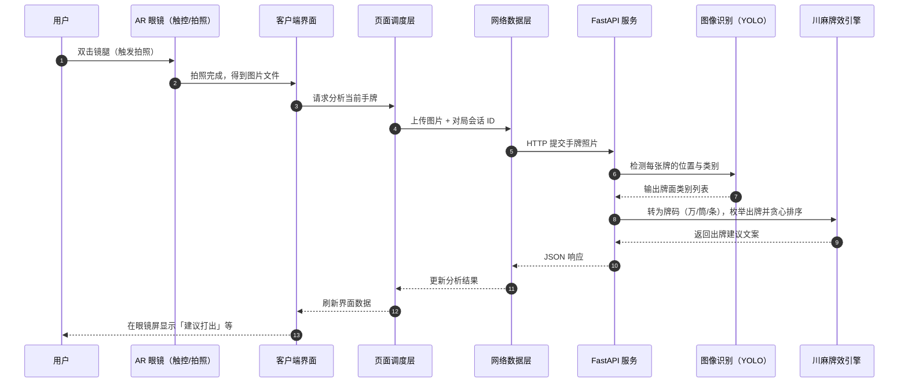

# AR 川麻助手

本项目面向 **四川麻将（血战到底，万/筒/条 108 张）**：结合 **AR 眼镜** 与 **本地化 AI**，通过眼镜采集手牌图像，在本地服务器进行 YOLO 识别与 **川麻牌效（听牌距离 + 进张贪心）** 分析，并将建议投射到眼镜屏幕。

## 简介

- **眼镜端**：负责手势交互、拍照/录音，并把数据发到同一局域网内的后端。
- **服务端**：用 YOLO 识别牌面，用牌理库算 **听牌距离 + 进张**，贪心选出当前最优出牌；语音可走「转写 → 大模型解析场况」的辅助链路。
- **川麻规则**：只保留万/筒/条（108 张），不吃牌；字牌不参与牌效计算。

## 主流程：从双击到出牌建议（时序）

下图用**功能角色**描述：

说明：当前后端 **需要识别到恰好 14 张序数牌** 才会给出牌建议；张数不足时会提示重拍。

算法简介：
 **核心技术**
  - **YOLOv8 (ONNX)**: 本地运行麻将牌识别模型 (位于 `server/models/yolo`)。
  - **Local LLM Integration**: 通过 OpenAI 兼容API连接本地、云端大模型。
  - **Mahjong Library**: 牌理分析（川麻：仅万筒条，关闭国士路径；听牌距离与进张贪心）。

一句话串起来：
YOLO 负责“看见牌”，LLM 负责“听懂话”，Mahjong Library 负责“算怎么打”。

1）YOLOv8 (ONNX)

功能
把上传的手牌图片识别成牌框和类别（如 1C、9B）
再转换成内部牌码（如 1m、9s），供后续牌效计算使用

2）Local LLM Integration（OpenAI 兼容 API）

功能
把语音转写文本（来自 STT）解析成结构化事件，比如 DISCARD、PON、KAN、HU
做规则过滤（你现在改成川麻后，不允许吃、过滤字牌等）

3）Mahjong Library（牌理计算）
功能
对候选出牌做枚举，计算每种出牌后的听牌距离和进张，按贪心规则选出当前最优打并返回建议

贪心规则简介：

你有 14 张牌，程序把“每一种可打的牌”都试一遍。
对每个候选出牌，算两个分数：
1）听牌距离：越小越好；
2）进张：越大越好。
然后排序规则是：
第一优先级：听牌距离 升序（0 比 1 好）
第二优先级：进张 降序（20 比 12 好）

先把听牌距离尽快压小；
再在同样听牌距离里，选进张最多的。
它不做全局博弈搜索（比如不模拟后面好几巡、对手行为、番型收益等）。
所以叫贪心：快、实用，但不保证所有局面都全局最优。

## 🌟 核心特性 (New)

- **完全本地化**: 图像识别采用 ONNX Runtime 本地运行，无需上传图片至第三方云服务，保护隐私且低延迟。
- **语音交互**: 集成FasterWhisper语音转文本和 LLM 接口(如 Qwen) 进行自然语言意图理解，支持通过语音识别场况计算“绝张”。
- **Docker 部署**: 提供标准化的 Docker 环境，一键启动后端服务。

