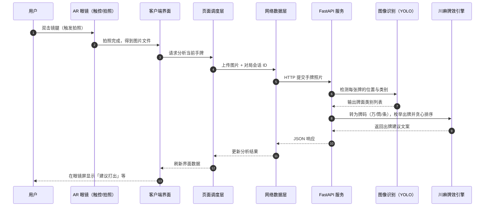

# ARmahjongAssist（AR 川麻助手）

本项目面向 **四川麻将（血战到底，万/筒/条 108 张）**：结合 **RayNeo AR 眼镜** 与 **本地化 AI**，通过眼镜采集手牌图像，在本地服务器进行 YOLO 识别与 **川麻牌效（听牌距离 + 进张贪心）** 分析，并将建议投射到眼镜屏幕。

## 简介

- **眼镜端**：负责手势交互、拍照/录音，并把数据发到同一局域网内的后端。
- **服务端**：用 YOLO 识别牌面，用牌理库算 **听牌距离 + 进张**，贪心选出当前最优出牌；语音可走「转写 → 大模型解析场况」的辅助链路。
- **川麻规则**：只保留万/筒/条（108 张），不吃牌；字牌不参与牌效计算。

## 主流程：从双击到出牌建议（时序）

下图用**功能角色**描述，不绑定具体类名或函数名：



说明：当前后端 **需要识别到恰好 14 张序数牌** 才会给出牌建议；张数不足时会提示重拍。

## 🌟 核心特性 (New)

- **完全本地化**: 图像识别采用 ONNX Runtime 本地运行，无需上传图片至第三方云服务，保护隐私且低延迟。
- **语音交互**: 集成FasterWhisper语音转文本和 LLM 接口(如 Qwen) 进行自然语言意图理解，支持通过语音识别场况计算“绝张”。
- **Docker 部署**: 提供标准化的 Docker 环境，一键启动后端服务。

## 🛠 项目架构

本项目分为两个核心部分：

### 1. 客户端 (Client) - `app/`
- **平台**: Android (Min SDK 31, Target SDK 36)
- **设备**: RayNeo AR 眼镜
- **功能**: 负责拍摄麻将手牌照片，上传至服务器，并接收服务器返回的切牌/鸣牌建议进行显示。

### 2. 服务端 (Server) - `server/`
- **语言**: Python 3.9+
- **框架**: FastAPI
- **核心技术**:
  - **YOLOv8 (ONNX)**: 本地运行麻将牌识别模型 (位于 `server/models/yolo`)。
  - **Local LLM Integration**: 通过 OpenAI 兼容API连接本地、云端大模型。
  - **Mahjong Library**: 牌理分析（川麻：仅万筒条，关闭国士路径；听牌距离与进张贪心）。
- **功能**: 接收图像，识别手牌与副露，计算当前最优打法，维护对局状态。

---

## 🚀 快速开始 (Docker 部署 - 推荐)

### 前置要求
1. 安装 **[Docker Desktop](https://www.docker.com/products/docker-desktop/)** (包含 Docker 和 Docker Compose)。
2. 准备一个兼容 OpenAI 接口的本地大模型服务 (推荐使用 [LM Studio](https://lmstudio.ai/) 或 [Ollama](https://ollama.com/) 运行 Qwen-4B 或类似模型)。

### 部署步骤 

1.  **克隆项目**
    ```bash
    git clone https://github.com/fAres4s/ARmahjongAssist.git
    cd ARmahjongAssist
    ```

2.  **配置环境变量**
    进入 `server` 目录，复制 `.env.example` ，命名副本为 `.env`：
    ```bash
    cd server
    cp .env.example .env
    ```
    编辑 `.env` 文件，配置本地 LLM 地址 (例如 LM Studio 默认是 `http://host.docker.internal:1234/v1`)：
    ```env
    LLM_BASE_URL=http://host.docker.internal:1234/v1
    LLM_API_KEY=lm-studio
    LLM_MODEL=qwen/qwen3-4b-2507 (复制于 LM Studio server配置页面右侧的API Usage -> This model's API identifier)
    ```

3.  **启动服务**
    返回项目根目录并构建启动：
    ```bash
    cd ..
    docker-compose up -d --build
    ```
    服务将运行在 `http://localhost:8000`。

### 3. Android 客户端调试 (App)

1.  **环境准备**
    - [Android Studio](https://developer.android.com/studio) Ladybug 或更高版本。
    - [JDK](https://www.oracle.com/java/technologies/downloads/) 17 或更高版本。
    - RayNeo X3 AR 眼镜或其他兼容 Android 设备 (需开启开发者模式/USB调试)。

2.  **配置服务端地址**
    - 确保眼镜与电脑处于**同一局域网**。
    - 获取电脑的局域网 IP (例如 `192.168.1.100`)。
    - 在 `app/src/main/java/com/example/ai_assist/AppConfig.kt` 中修改 `SERVER_BASE_URL`（例如 `http://192.168.1.100:8000/`）。

3.  **编译与安装**
    - 使用 Android Studio 打开项目根目录。
    - 等待 Gradle Sync 完成。
    - 通过 USB 连接设备。
    - 点击顶部工具栏的 **Run 'app'** (绿色播放按钮)。
    - 应用将安装在设备上并启动，眼镜需要先连接到WiFi后才能使用。

### 4. 客户端配置 (AppConfig)

客户端的全局配置位于 `app/src/main/java/com/example/ai_assist/AppConfig.kt`，您可以根据需要修改以下常量：

- **SERVER_BASE_URL**: 后端服务器地址（例如 `http://192.168.1.100:8000/`）。
- **USE_COLOR_FONT**: 是否启用彩色麻将字体（`true` 为彩色，`false` 为默认单色）。
- **FONT_SCALE_COLOR**: 彩色字体的缩放比例（默认 `1.8f`）。
- **FONT_SCALE_DEFAULT**: 单色字体的缩放比例（默认 `2.5f`）。

### 5. 测试与调试

- **开始/结束对局**：三击右侧触控区域开始/结束对局。
- **麻将识别**：在每一句对局开始之后，可以单击触控区域开启拍照。
- **使用语音场况感知**：向后滑动镜腿，可以开始/停止语音录制。
- **查看切牌建议**：根据当前手牌状态，眼镜屏幕上会显示最优切牌建议。

### 6. YOLO 参数调试工具 (YOLO Debug Tool)

为了优化不同光照和环境下的麻将牌识别效果，本项目提供了一个可视化的参数调试工具。

1.  **访问工具**
    确保服务端已启动，在浏览器中访问：
    `http://localhost:8000/static/yolo_debug.html`

2.  **功能说明**
    - **上传图片**: 上传一张实际拍摄的麻将手牌图片，本项目默认的输入尺寸是1200x400（实际拍摄手牌的照片是1200x800，上下等分为暗牌和鸣牌组合，分别识别）。
    - **调整参数**: 实时调整 **Confidence Threshold** (置信度) 和 **IoU Threshold** (重叠阈值)。
    - **可视化分析**: 点击“分析”后，右侧会显示识别结果的标注图。

3.  **配置生效**
    - 在调试工具中的调整**仅对当前调试请求生效**，不会影响正在进行的对局。
    - 调试出满意的参数后，请修改服务端根目录下的 `.env` 文件以永久生效：
      ```env
      YOLO_CONF_THRESHOLD=0.54  # 示例值
      YOLO_IOU_THRESHOLD=0.85   # 示例值
      ```
    - 修改配置文件后需要重启服务端：
    ```bash
    docker-compose restart backend
    ```

---

## 💻 开发者指南 (源码运行)

如果您需要修改服务端代码或进行调试，可以直接在本地运行 Python 环境。

1.  **环境准备**
    ```bash
    cd server
    python -m venv venv
    source venv/bin/activate  # 示例为MacOS，Windows 请执行: venv\Scripts\activate
    pip install -r requirements.txt
    ```

2.  **运行服务**
    确保 `.env` 配置正确，然后运行：
    ```bash
    python main.py
    ```

3.  **运行测试**
    ```bash
    pytest tests
    ```

---

## 📂 目录结构说明

### 项目总体结构

```text
ARmahjongAssist/
├── app/                 # Android 客户端 (RayNeo AR 眼镜端)
├── server/              # Python 服务端 (AI 推理与业务逻辑)
├── docker-compose.yml   # Docker 一键部署配置
└── README.md            # 项目文档
```

### App 目录详解 (Android Client)

```text
app/
├── libs/                    # 外部依赖库 (RayNeo SDK)
├── src/main/java/com/example/ai_assist/
│   ├── model/               # 数据模型 (API 响应实体、会话状态)
│   ├── repository/          # 数据仓库层 (处理 API 调用与数据流)
│   ├── service/             # 核心服务模块
│   │   ├── GameApiService.kt      # Retrofit 接口定义 (与 Server 通信)
│   │   └── RayNeoDeviceManager.kt # RayNeo 硬件控制 (按键、传感器)
│   ├── utils/               # 工具类
│   │   ├── RayNeoAudioRecorder.kt # 音频录制工具
│   │   └── MahjongMapper.kt       # 麻将编码映射工具
│   ├── viewmodel/           # MVVM ViewModel (UI 状态管理)
│   └── MainActivity.kt      # 主界面入口
│   └── src/main/res/            # UI 资源文件 (布局、图标、样式)
```

### Server 目录详解

```text
server/
├── models/                  # 本地模型文件仓库
│   └── yolo/                # YOLOv8 ONNX 模型及类别文件
├── static/                  # 静态资源目录
│   └── uploads/             # 存放客户端上传的临时图片
├── tests/                   # 单元测试与集成测试用例
├── main.py                  # FastAPI 应用入口，服务初始化与路由定义
├── config.py                # 配置管理 (环境变量加载、路径定义)
├── vision_service.py        # 视觉识别服务：封装 YOLO 模型调用与坐标转换
├── yolo_inference.py        # YOLO 推理核心：基于 ONNX Runtime 的图像预处理与后处理
├── llm_service.py           # LLM 服务：与本地大模型 (OpenAI 接口) 交互，处理自然语言意图
├── stt_service.py           # 语音转文字服务：基于 faster-whisper 实现离线语音识别
├── efficiency_engine.py     # 川麻牌效：听牌距离 + 进张贪心（仅万筒条）
├── mahjong_state_tracker.py # 状态追踪器：维护对局状态 (手牌、副露、场况)
├── database.py              # 数据库模块：SQLite 封装，记录对局历史与交互日志
├── schemas.py               # Pydantic 数据模型：定义 API 请求与响应结构
├── Dockerfile               # 服务端镜像构建文件
└── requirements.txt         # Python 依赖列表
```

### 核心模块交互流程
1. **图像上传**: 客户端发送图片 -> `main.py` 接收 -> 保存至 `static/uploads`。
2. **视觉识别**: `VisionService` 调用 `yolo_inference.py` 解析图片，提取麻将牌坐标与类别。
3. **状态更新**: 识别结果传入 `MahjongStateTracker`，更新当前手牌状态。
4. **牌效计算**: `EfficiencyEngine` 基于川麻手牌计算听牌距离与进张（贪心选切）。
5. **LLM 意图分析** (可选): 若包含语音，`STTService` 转录文本 -> `LLMService` 分析用户意图 (如"刚才打了什么") -> 改变 `MahjongStateTracker` 的可见牌列表。
6. **结果返回**: 综合视觉与牌效结果，通过 `schemas.py` 定义的格式返回给客户端。

---

## 推送到 GitHub

本地已初始化 Git 并完成首次提交。在 GitHub 新建空仓库后，在项目根目录执行（将 `你的用户名` 与仓库名换成实际值）：

```bash
git remote add origin https://github.com/你的用户名/仓库名.git
git push -u origin main
```

若使用 SSH：`git remote add origin git@github.com:你的用户名/仓库名.git`。

---

## 致谢

感谢 Jon Chan 提供的 [Mahjong Dataset](https://universe.roboflow.com/jon-chan-gnsoa/mahjong-baq4s)。该数据集发布于 Roboflow Universe (2026-01-26)。特别感谢其提供的开源数据支持了我们的 CV 模型训练。

感谢 [FluffyStuff/riichi-mahjong-tiles](https://github.com/FluffyStuff/riichi-mahjong-tiles/tree/master) 提供的麻将 PNG 素材。

感谢 [SYSTRAN/faster-whisper](https://github.com/SYSTRAN/faster-whisper) 提供的快速语音转文本支持。

感谢 [googlefonts/nanoemoji](https://github.com/googlefonts/nanoemoji) 工具支持彩色麻将字体的制作。
